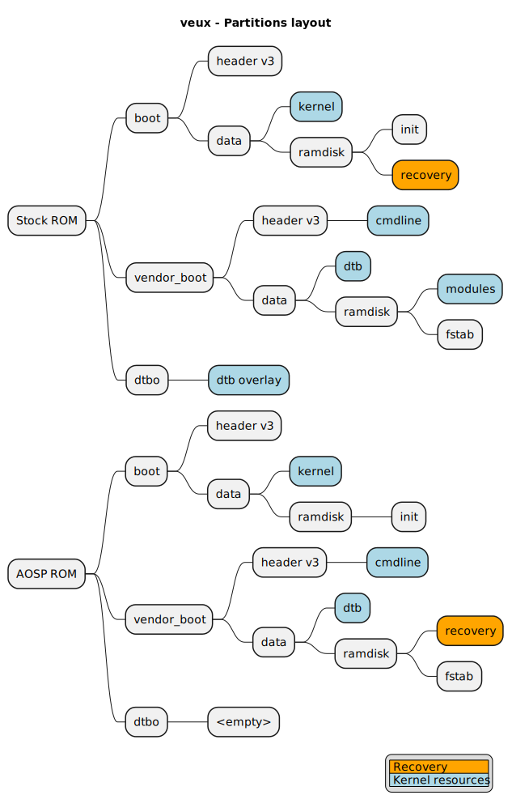

# recovery partition
veux/peux does not have dedicated `recovery` partition

The actual recovery resides in either `boot` or `vendor_boot` partition, depending on your current ROM.



Do not try to `fastboot boot recovery.img`, it will not work.

## ⛔ DO NOT
```
fastboot flash boot boot.img
fastboot reboot
```
or this,
```
fastboot flash vendor_boot vendor_boot.img
fastboot reboot
```
or this,
```
fastboot flash boot boot.img
fastboot flash vendor_boot vendor_boot.img
fastboot reboot
```
or this,
```
fastboot flash dtbo dtbo.img
fastboot reboot
```
because you will mix-and-match kernel components individually, and you may face:
- stuck in fastboot/bootloader mode
- bootloop
- broken drivers (modem, wi-fi, bluetooth...)

## ✅ DO
```
fastboot flash boot boot.img
fastboot flash vendor_boot vendor_boot.img
fastboot flash dtbo dtbo.img
fastboot reboot recovery
```